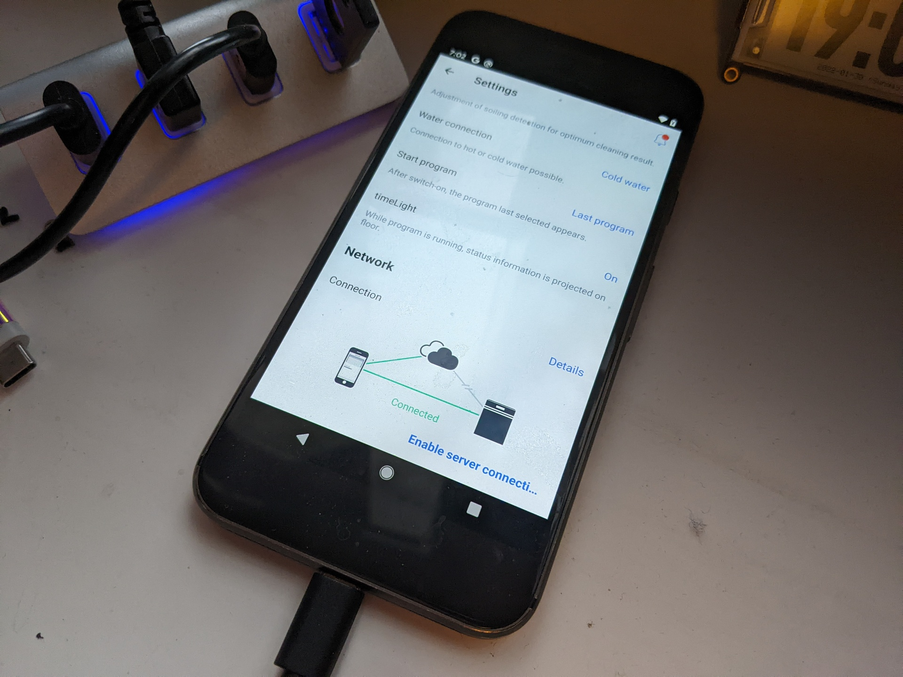
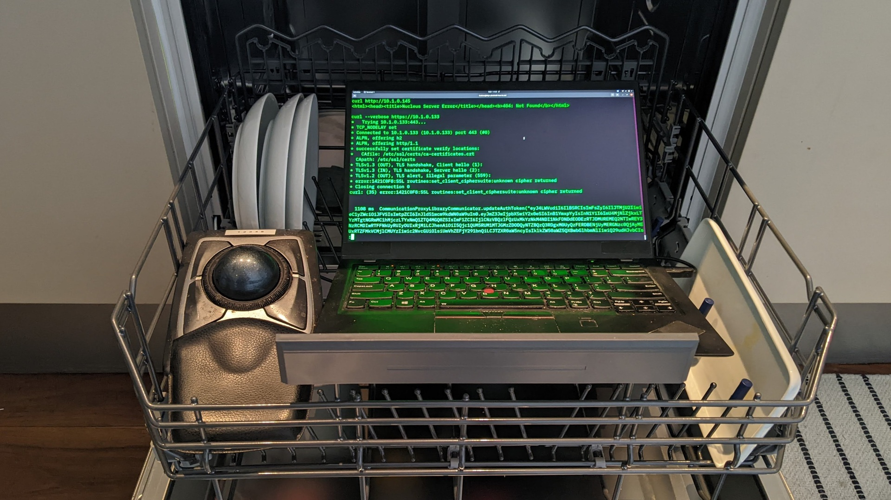

# Interface with Home Connect appliances in Python

This is a very, very beta interface for Bosch-Siemens Home Connect
devices through their local network connection.  It has some tools
to find the TLS PSK (Pre-shared Key) that is used to allow local
access, and a Python script that can construct the proper Websocket
interface to subscribe to events.

*WARNING: This is not ready for prime time!*

The dishwasher has a local HTTPS port open.  Attempting to connect to
the HTTPS port with `curl` results in a cryptic protocol error
due to the non-standard cipher selection, `ECDHE-PSK-CHACHA20-POLY1305`.
PSK also requires that both sides agree on a symetric key,
so it is necessary to figure out what that key is before any
further progress can be made.

The clothes washer has a local HTTP port that also responds to websocket
traffic, although the contents of the frames are AES-CBC encrypted with a key
derived from the PSK and authenticated with SHA256-HMAC using another
key derived from the PSK.  It is also necessary to find the IV for the AES
encryption to communicate with the washer.

Despite the usual reputation for bad IoT security, Bosch-Siemens seem to
have done a decent job of designing their system, especially since they
considered a no-cloud local control configuration.  The protocols seem
sound and should prevent most any random attacker on your network from
being able to take over your appliances to mine cryptocurrency.


## Finding the PSK (and IV)



You will need to set the dishwasher to "`Local network only`"
in the setup application so that your phone will connect
directly to it, rather than going through the cloud services.

You'll also need a rooted Android phone running `frida-server`
and the `find-psk.frida` script.  This will hook the callback
from the OpenSSL library `hcp::client_psk_callback` that is called
when OpenSSL has made a connection and now needs to establish
the PSK.

```
frida --no-pause -f com.bshg.homeconnect.android.release -U -l find-psk.frida
```

It should start the Home Connect application and eventually
print a message like:

```
psk callback hint 'HCCOM_Local_App'
psk 32 0x6ee63fb2f0
           0  1  2  3  4  5  6  7  8  9  A  B  C  D  E  F  0123456789ABCDEF
00000000  0e c8 1f d8 c6 49 fa d8 bc e7 fd 34 33 54 13 d4  .....I.....43T..
00000010  73 f9 2e 01 fc d8 26 80 49 89 4c 19 d7 2e cd cb  s.....&.I.L.....
```

Which gives you the 32-byte PSK value to copy into the `hcpy` program.

## SSL logging

The Frida script will also dump all of the SSL traffic so that you can
see different endpoints and things.  Not much is documented yet.

Note that the TX from the phone on the websocket is "masked" with an
repeating 4-byte XOR that is sent in the first part of each messages.
The script could be augmented to decode those as well.
The replies from the device are not masked so they can be read in the clear.

## Retrieving home appliance configuration

```
frida-trace -o initHomeAppliance.log -f "com.bshg.homeconnect.android.release" -U -j '*!initHomeAppliance''
```

PSK can also be found in the last section of the config as base64url encoded.

```
echo 'Dsgf2MZJ-ti85_00M1QT1HP5LgH82CaASYlMGdcuzcs"' | tr '_\-"' '/+=' | base64 -d | xxd -g1
```

The IV is also there for devices that use it.  This needs better documentation.

TODO: document the other frida scripts that do `sendmsg()` and `Encrypt()` / `Decrypt()` tracing


## hcpy



The `hcpy` tool can contact your device, and if the PSK is correct, it will
register for notification of events.

```
RX: {'sID': 2354590730, 'msgID': 3734589701, 'resource': '/ei/initialValues', 'version': 2, 'action': 'POST', 'data': [{'edMsgID': 3182729968}]}
TX: {"sID":2354590730,"msgID":3734589701,"resource":"/ei/initialValues","version":2,"action":"RESPONSE","data":[{"deviceType":"Application","deviceName":"py-hca","deviceID":"1234"}]}
TX: {"sID":2354590730,"msgID":3182729968,"resource":"/ci/services","version":1,"action":"GET"}
TX: {"sID":2354590730,"msgID":3182729969,"resource":"/iz/info","version":1,"action":"GET"}
TX: {"sID":2354590730,"msgID":3182729970,"resource":"/ei/deviceReady","version":2,"action":"NOTIFY"}
RX: {'sID': 2354590730, 'msgID': 3182729968, 'resource': '/ci/services', 'version': 1, 'action': 'RESPONSE', 'data': [{'service': 'ci', 'version': 3}, {'service': 'ei', 'version': 2}, {'service': 'iz', 'version': 1}, {'service': 'ni', 'version': 1}, {'service': 'ro', 'version': 1}]}
RX: {'sID': 2354590730, 'msgID': 3182729969, 'resource': '/iz/info', 'version': 1, 'action': 'RESPONSE', 'data': [{'deviceID': '....', 'eNumber': 'SX65EX56CN/11', 'brand': 'SIEMENS', 'vib': 'SX65EX56CN', 'mac': '....', 'haVersion': '1.4', 'swVersion': '3.2.10.20200911163726', 'hwVersion': '2.0.0.2', 'deviceType': 'Dishwasher', 'deviceInfo': '', 'customerIndex': '11', 'serialNumber': '....', 'fdString': '0201', 'shipSki': '....'}]}
```

## Feature UID mapping

There are other things that can be hooked in the application
to get the mappings of the `uid` to actual menu settings and
XML files of the configuration parameters.

In the `xml/` directory are some of the device descriptions
and feature maps that the app downloads from the Home Connect
servers.  Note that the XML has unadorned hex, while the
websocket messages are in decimal.

For instance, when the dishwasher door is closed and then
re-opened, it sends the messages for `'uid':512`, which is 0x020F hex:

```
RX: {... 'data': [{'uid': 527, 'value': 1}]}
RX: {... 'data': [{'uid': 527, 'value': 0}]}
```

In the `xml/dishwasher-description.xml` there is a `statusList`
that says uid 0x020f is a readonly value that uses enum 0x0201:

```
    <status access="read" available="true" enumerationType="0201" refCID="03" refDID="80" uid="020F"/>
```

In the `xml/dishwasher-featuremap.xml` there is a mapping of feature
reference UIDs to names:

```
    <feature refUID="020F">BSH.Common.Status.DoorState</feature>
```

as well as mappings of enum ids to enum names and values:

```
    <enumDescription enumKey="BSH.Common.EnumType.DoorState" refENID="0201">
      <enumMember refValue="0">Open</enumMember>
      <enumMember refValue="1">Closed</enumMember>
    </enumDescription>
```


