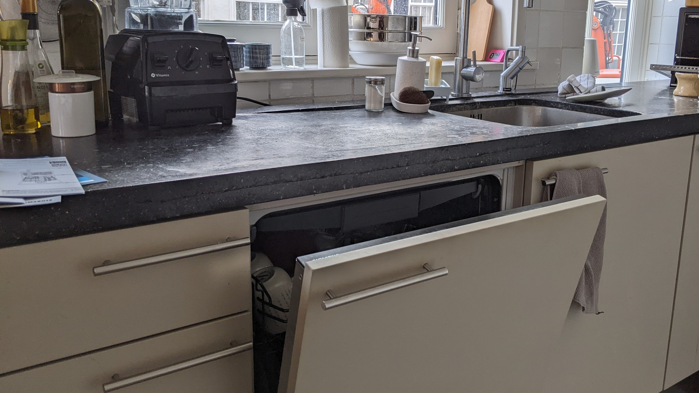
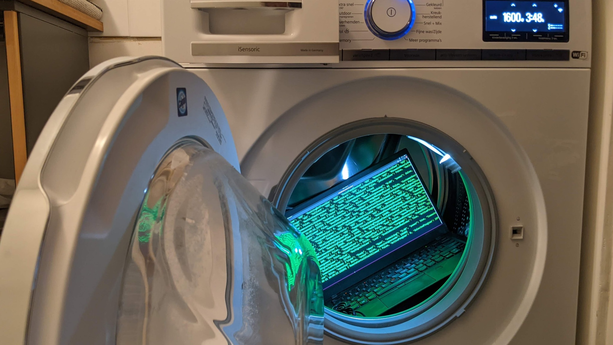
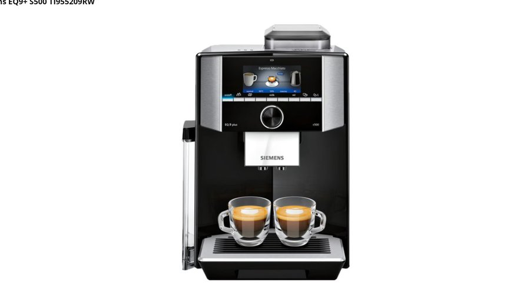

# Interface with Home Connect appliances in Python

This is a very, very beta interface for Bosch-Siemens Home Connect
devices through their local network connection.  Unlike most
IoT devices that have a reputation for very bad security, BSG seem to have
done a decent job of designing their system, especially since
they allow a no-cloud local control configuration.  The protocols
seem sound, use well tested cryptographic libraries (TLS PSK with
modern ciphres) or well understood primitives (AES-CBC with HMAC),
and should prevent most any random attacker on your network from being able to
[take over your appliances to mine cryptocurrency](http://www.antipope.org/charlie/blog-static/2013/12/trust-me.html).

*WARNING: This tool not ready for prime time and is still beta!*

## Setup

```
pip3 -r requirements.txt
```

Install the Python dependencies; the `sslpsk` one is a little weird
and we might need to revisit it later.


## Authenticate to the cloud servers


```
hc-login $USERNAME $PASSWORD > config.json
```

The `hc-login` script perfoms the OAuth process to login to your
Home Connect account with your usename and password.  It
receives a bearer token that can then be used to retrieves
a list of all the connected devices, their authentication
and encryption keys, and XML files that describe all of the
features and options.

This only needs to be done once or when you add new devices;
the resulting configuration JSON file *should* be sufficient to
connect to the devices on your local network, assuming that
your mDNS or DNS server resolves the names correctly.


## Home Connect to MQTT

```
hc2mqtt config.json
```

This tool will establish websockets to the local devices and
transform their messages into MQTT JSON messages.  The exact
format is likely to change; it is currently a thin translation
layer over the XML retrieved from cloud servers during the
initial configuration.

### Dishwasher



The dishwasher has a local HTTPS port open, although attempting to connect to
the HTTPS port with `curl` results in a cryptic protocol error
due to the non-standard cipher selection, `ECDHE-PSK-CHACHA20-POLY1305`.
PSK also requires that both sides agree on a symetric key,
so a special hacked version of `sslpsk` is used to establish the
connection and then hand control to the Python `websock-client`
library.

Example message published to `homeconnect/dishwasher`:

```
{
	"state":	"Run",
	"door":		"Closed",
	"remaining":	"2:49",
	"power":	true,
	"lowwaterpressure": false,
	"aquastop":	false,
	"error":	false,
	"remainingseconds": 10140
}
```

<details>
<summary>Full state information</summary>

```
{
	'AllowBackendConnection': False,
	'BackendConnected': False,
	'RemoteControlLevel': 'ManualRemoteStart',
	'SoftwareUpdateAvailable': 'Off',
	'ConfirmPermanentRemoteStart': 'Off',
	'ActiveProgram': 0,
	'SelectedProgram': 8192,
	'RemoteControlStartAllowed': False,
	'520': '2022-02-21T16:48:54',
	'RemoteControlActive': True,
	'AquaStopOccured': 'Off',
	'DoorState': 'Open',
	'PowerState': 'Off',
	'ProgramFinished': 'Off',
	'ProgramProgress': 100,
	'LowWaterPressure': 'Off',
	'RemainingProgramTime': 0,
	'ProgramAborted': 'Off',
	'547': False,
	'RemainingProgramTimeIsEstimated': True,
	'OperationState': 'Inactive',
	'StartInRelative': 0,
	'EnergyForecast': 82,
	'WaterForecast': 70,
	'ConnectLocalWiFi': 'Off',
	'SoftwareUpdateTransactionID': 0,
	'SoftwareDownloadAvailable': 'Off',
	'SoftwareUpdateSuccessful': 'Off',
	'ProgramPhase': 'Drying',
	'SilenceOnDemandRemainingTime': 0,
	'EcoDryActive': False,
	'RinseAid': 'R04',
	'SensitivityTurbidity': 'Standard',
	'ExtraDry': False,
	'HotWater': 'ColdWater',
	'TimeLight': 'On',
	'EcoAsDefault': 'LastProgram',
	'SoundLevelSignal': 'Off',
	'SoundLevelKey': 'Medium',
	'WaterHardness': 'H04',
	'DryingAssistantAllPrograms': 'AllPrograms',
	'SilenceOnDemandDefaultTime': 1800,
	'SpeedOnDemand': False,
	'InternalError': 'Off',
	'CheckFilterSystem': 'Off',
	'DrainingNotPossible': 'Off',
	'DrainPumpBlocked': 'Off',
	'WaterheaterCalcified': 'Off',
	'LowVoltage': 'Off',
	'SaltLack': 'Off',
	'RinseAidLack': 'Off',
	'SaltNearlyEmpty': 'Off',
	'RinseAidNearlyEmpty': 'Off',
	'MachineCareReminder': 'Off',
	'5121': False,
	'HalfLoad': False,
	'IntensivZone': False,
	'VarioSpeedPlus': False,
	'5131': False,
	'5134': True,
	'SilenceOnDemand': False
}
```
</details>


### Clothes washer



The clothes washer has a local HTTP port that also responds to websocket
traffic, although the contents of the frames are AES-CBC encrypted with a key
derived from `HMAC(PSK,"ENC")` and authenticated with SHA256-HMAC using another
key derived from `HMAC(PSK,"MAC")`.  The encrypted messages are send as
binary data over the websocket (type 0x82).

Example message published to `homeconnect/washer`:

```
{
	"state": "Ready",
	"door": "Closed",
	"remaining": "3:48",
	"power": true,
	"lowwaterpressure": false,
	"aquastop": false,
	"error": false,
	"remainingseconds": 13680
}
```

<details>
<summary>Full state information</summary>

```
{
	'BackendConnected': False,
	'CustomerEnergyManagerPaired': False,
	'CustomerServiceConnectionAllowed': False,
	'DoorState': 'Open',
	'FlexStart': 'Disabled',
	'LocalControlActive': False,
	'OperationState': 'Ready',
	'RemoteControlActive': True,
	'RemoteControlStartAllowed': False,
	'WiFiSignalStrength': -50,
	'LoadInformation': 0,
	'AquaStopOccured': 'Off',
	'CustomerServiceRequest': 'Off',
	'LowWaterPressure': 'Off',
	'ProgramFinished': 'Off',
	'SoftwareUpdateAvailable': 'Off',
	'WaterLevelTooHigh': 'Off',
	'DoorNotLockable': 'Off',
	'DoorNotUnlockable': 'Off',
	'DoorOpen': 'Off',
	'FatalErrorOccured': 'Off',
	'FoamDetection': 'Off',
	'DrumCleanReminder': 'Off',
	'PumpError': 'Off',
	'ReleaseRinseHoldPending': 'Off',
	'EnergyForecast': 20,
	'EstimatedTotalProgramTime': 13680,
	'FinishInRelative': 13680,
	'FlexFinishInRelative': 0,
	'ProgramProgress': 0,
	'RemainingProgramTime': 13680,
	'RemainingProgramTimeIsEstimated': True,
	'WaterForecast': 40,
	'LoadRecommendation': 10000,
	'ProcessPhase': 4,
	'ReferToProgram': 0,
	'LessIroning': False,
	'Prewash': False,
	'RinseHold': False,
	'RinsePlus': 0,
	'SilentWash': False,
	'Soak': False,
	'SpeedPerfect': False,
	'SpinSpeed': 160,
	'Stains': 0,
	'Temperature': 254,
	'WaterPlus': False,
	'AllowBackendConnection': False,
	'AllowEnergyManagement': False,
	'AllowFlexStart': False,
	'ChildLock': False,
	'Language': 'En',
	'PowerState': 'On',
	'EndSignalVolume': 'Medium',
	'KeySignalVolume': 'Loud',
	'EnableDrumCleanReminder': True,
	'ActiveProgram': 0,
	'SelectedProgram': 28718
}
```
</details>


### Coffee Machine



The coffee machine needs a better mapping to MQTT messages.

<details>
<summary>Full state information</summary>

```
{
	'LastSelectedBeverage': 8217,
	'LocalControlActive': False,
	'PowerSupplyError': 'Off',
	'DripTrayNotInserted': 'Off',
	'DripTrayFull': 'Off',
	'WaterFilterShouldBeChanged': 'Off',
	'WaterTankEmpty': 'Off',
	'WaterTankNearlyEmpty': 'Off',
	'BrewingUnitIsMissing': 'Off',
	'SelectedProgram': 0,
	'MacchiatoPause': '5Sec',
	'ActiveProgram': 0,
	'BeverageCountdownWaterfilter': 48,
	'BeverageCountdownCalcNClean': 153,
	'RemoteControlStartAllowed': True,
	'EmptyDripTray': 'Off',
	'BeverageCountdownDescaling': 153,
	'EmptyDripTrayRemoveContainer': 'Off',
	'BeverageCounterRistrettoEspresso': 177,
	'AllowBackendConnection': True,
	'BeverageCounterHotWater': 37351,
	'RemindForMilkAfter': 'Off',
	'BeverageCounterFrothyMilk': 22,
	'BeverageCounterCoffeeAndMilk': 1077,
	'CustomerServiceRequest': 'Off',
	'4645': 0,
	'CoffeeMilkOrder': 'FirstCoffee',
	'BackendConnected': True,
	'BeverageCounterCoffee': 21,
	'Enjoy': 'Off',
	'UserMode': 'Barista',
	'PlaceEmptyGlassUnderOutlet': 'Off',
	'WaterTankNotInserted': 'Off',
	'PlaylistRunning': False,
	'BeverageCounterPowderCoffee': 9,
	'DemoModeActive': False,
	'CleanBrewingUnit': 'Off',
	'WaterHardness': 'Medium',
	'CloseDoor': 'Off',
	'EmptyMilkTank': 'Off',
	'SpecialRinsing': 'Off',
	'AllowConsumerInsights': False,
	'SwitchOffAfter': '01Hours15Minutes',
	'4681': 0,
	'LastSelectedCoffeeWorldBeverage': 20514,
	'BrightnessDisplay': 7,
	'CleanMilkTank': 'Off',
	'NotEnoughWaterForThisKindOfBeverage': 'Off',
	'ChildLock': False,
	'4666': 0,
	'Language': 'De',
	'MilkContainerConnected': 'Off',
	'SoftwareUpdateAvailable': 'Off',
	'LeaveProfilesAutomatically': True,
	'RemoveWaterFilter': 'Off',
	'OperationState': 'Inactive',
	'BeverageCounterHotMilk': 9,
	'4362': 0,
	'MilkTubeRemoved': 'Off',
	'DeviceIsToCold4C': 'Off',
	'SystemHasRunDry': 'Off',
	'DeviceShouldBeDescaled': 'Off',
	'PowerState': 'Standby',
	'DeviceShouldBeCleaned': 'Off',
	'DeviceShouldBeCalcNCleaned': 'Off',
	'BeanContainerEmpty': 'Off',
	'MilkStillOK': 'Off',
	'CoffeeOutletMissing': 'Off',
	'MilkReminder': 'Off',
	'RefillEmptyWaterTank': 'Off',
	'RefillEmptyBeanContainer': 'Off',
	'UnderOverVoltage': 'Off',
	'NotEnoughPomaceCapacityForThisKindOfBeverage': 'Off',
	'AdjustGrindSetting': 'Off',
	'InsertWaterFilter': 'Off',
	'FillDescaler': 'Off',
	'CleanFillWaterTank': 'Off',
	'PlaceContainerUnderOutlet': 'Off',
	'SwitchOffPower30sekBackOn': 'Off',
	'ThrowCleaningDiscInTheDrawer': 'Off',
	'RemoveMilkContainer': 'Off',
	'RemoveContainerUnderOutlet': 'Off',
	'MilkContainerRemoved': 'Off',
	'ServiceProgramFinished': 'Off',
	'DeviceDescalingOverdue': 'Off',
	'DeviceDescalingBlockage': 'Off',
	'CustomerServiceConnectionAllowed': False,
	'BeverageCountdownCleaning': 38,
	'ProcessPhase': 'None'
}
```
</details>

## Posting to the appliance

Whereas the reading of de status is very beta, this is very very alpha. There is some basic error handling, but don't expect that everything will work.

In your config file you can find items that contain `readWrite` or `writeOnly`, some of them contain values so you know what to provide, ie:

```json
"539": {
	"name": "BSH.Common.Setting.PowerState",
	"access": "readWrite",
	"available": "true",
	"refCID": "03",
	"refDID": "80",
	"values": {
		"2": "On",
		"3": "Standby"
	}
},
```

With this information you can build the JSON object you can send over mqtt to change the power state

Topic: `homeconnect/[devicename]/set`, ie `homeconnect/coffeemaker/set`

Payload:

```json
{"uid":539,"value":2}
```
As for now, the results will be displayed by the script only, there is no response to an mqtt topic.

There are properties that do not require predefined values, debugging is required to see what is needed. Here are some of those values found through debugging:

Set the time:

```json
{"uid":520,"value":"2023-07-07T15:01:21"}
```

Synchronize with time server, `false` is disabled

```json
{"uid":547,"value":false}
```

## FRIDA tools

Moved to [`README-frida.md`](README-frida.md)
